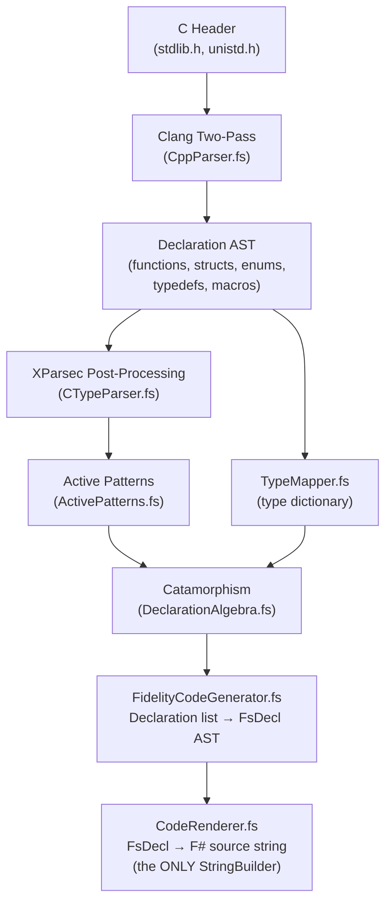

# Farscape

Clef bindings generator for C libraries, part of the Fidelity native compilation ecosystem.

[](LICENSE)
[](Commercial.md)

<p align="center">
Under Active Development<br>
<em>This project is in early development and the API may undergo breaking changes.</em>
</p>

## Overview

Farscape automatically generates Clef bindings from C header files. It uses **clang** for robust header parsing and **XParsec** parser combinators for post-processing C type declarations and preprocessor macro values, producing type-safe Clef code that integrates with the Fidelity native compilation toolchain.

The codebase is structured around four functional programming patterns that compose cleanly:

- **XParsec Parser Combinators** (`CTypeParser.fs`): Monadic parsers decompose C type declarations (`const char *` → `{ BaseType = "char"; PointerDepth = 1 }`), classify preprocessor macro values, and parse numeric literals, replacing all Regex usage
- **Active Patterns** (`ActivePatterns.fs`): XParsec-backed active patterns (`ParsedCType`, `CharPointer|VoidPointer|TypedPointer|ValueType`, `CompilerBuiltin|InternalMacro|UserMacro`, `IntegerLiteral`) provide structural decomposition at match sites
- **Catamorphism** (`DeclarationAlgebra.fs`): A fold algebra over the Declaration DU; one traversal function serves typedef extraction, function collection, and full code generation through composable algebras
- **Typed Code AST** (`CodeAST.fs` → `CodeRenderer.fs`): Generation produces `FsDecl` values (typed, inspectable, testable AST nodes), not strings. The ONLY `StringBuilder` in the codebase is the final `CodeRenderer.render`

Farscape is a key tool for the [Fidelity Framework](https://github.com/FidelityFramework) native Clef compilation ecosystem.

## Architecture



### Functional Patterns in Action

**XParsec parser** decomposes a C type declaration:

```fsharp
// CTypeParser.fs: monadic parser for C types
static let pCType =
    parser {
        do! skipMany pQualifier          // strip const, restrict, volatile
        let! firstWord = pTypeWord       // "unsigned"
        let! restWords = many (spaces1 >>. pTypeWord)  // "long", "int"
        let! stars = many (skipChar '*') // pointer depth
        return { BaseType = baseType; PointerDepth = stars.Length }
    }
```

**Active pattern** classifies the parsed result:

```fsharp
// ActivePatterns.fs: structural decomposition via pattern matching
match "const char *" with
| ParsedCType (CharPointer) -> Generic("nativeptr", Named "byte")
| ParsedCType (VoidPointer) -> Named "nativeint"
| ParsedCType (ValueType t) -> Named (TypeMapper.getFSharpType model t)
```

**Catamorphism** folds an algebra over all declarations in one pass:

```fsharp
// DeclarationAlgebra.fs: single traversal, composable algebras
let groups = cataDeclarations (generationAlgebra typedefMap) declarations
// One pass produces: enums, structs, functions, macros, all categorized
```

**Typed AST** separates generation from rendering:

```fsharp
// CodeAST.fs: typed nodes, not strings
LetBinding("memcpy",
    [{ Name = "dest"; Type = Named "nativeint" }; ...],
    Named "nativeint",
    DefaultOf (Named "nativeint"))
// CodeRenderer.fs renders to F# source (the ONLY StringBuilder)
```

### Core Modules

| Module | Purpose |
|--------|---------|
| `Types.fs` | Shared types: `OutputMode`, `PlatformABI` (LP64/LLP64/ILP32/IP16) |
| `CppParser.fs` | Clang two-pass parsing: JSON AST + macro extraction |
| `TypeMapper.fs` | NTU type dictionary: C types → Clef types, PlatformABI-parameterized |
| `CTypeParser.fs` | XParsec parsers for C type strings, macro values, numeric literals |
| `ActivePatterns.fs` | Type classification, macro filtering, keyword quoting via active patterns |
| `DeclarationAlgebra.fs` | Catamorphism: fold algebra over Declaration DU |
| `CodeAST.fs` | Typed code AST: `FsType`, `FsExpr`, `FsDecl` discriminated unions |
| `CodeRenderer.fs` | Single renderer: `FsDecl → string` (only StringBuilder in the codebase) |
| `FidelityCodeGenerator.fs` | Fidelity mode: catamorphism → FsDecl tree → rendered source |
| `WrapperPatternAnalyzer.fs` | Layer 2: clang attribute analysis → return semantic + parameter role classification |
| `WrapperCodeGenerator.fs` | Layer 2: idiomatic Clef wrapper generation with Result types |
| `ErrnoModuleGenerator.fs` | Error text infrastructure: CError struct, describe jump table, captureError helper |
| `PilotAnalyzer.fs` | Namespace filtering and declaration scoping from project files |
| `PilotSerializer.fs` | TOML project file parsing (`.pilot.toml`) |
| `BindingGenerator.fs` | Pipeline orchestration for single-header and project-based generation |

## Usage

```bash
# Generate Fidelity bindings from a standard library header
farscape generate \
    --header /usr/include/string.h \
    -l libc \
    -m fidelity \
    -n Fidelity.libc.Memory \
    -o ./output/

# Generate Fidelity bindings with idiomatic Clef wrappers (Layer 2)
farscape generate \
    --header /usr/include/unistd.h \
    -l libc \
    -m fidelity-wrappers \
    -n Fidelity.libc.IO \
    -o ./output/

# With include paths and defines (for CMSIS headers)
farscape generate \
    --header stm32l5xx_hal_gpio.h \
    -l __cmsis \
    -m fidelity \
    -i ./CMSIS/Core/Include,./STM32L5xx/Include \
    -d STM32L552xx,USE_HAL_DRIVER \
    -n Fidelity.CMSIS.GPIO \
    -v

Options:
      --header <header>         Path to C header file (required)
  -l, --library <library>       Name of native library (required)
  -o, --output <output>         Output directory [default: ./output]
  -n, --namespace <namespace>   Namespace for generated code [default: NativeBindings]
  -i, --include-paths <paths>   Additional include paths
  -d, --defines <defines>       Preprocessor definitions
  -m, --output-mode <mode>      Output mode: fidelity | fidelity-wrappers [default: fidelity]
  -v, --verbose                 Verbose output
```

## Output Modes

### Fidelity Mode (`--output-mode fidelity`)

Generates `[<FidelityExtern>]` binding declarations that feed the Composer native compilation pipeline:

```fsharp
module Fidelity.libc.Memory

// Generated by Farscape, Fidelity binding for libc
// Composer type-checks and compiles to native via MLIR/LLVM.

    /// void * memcpy(void *restrict __dest, const void *restrict __src, size_t __n)
    [<FidelityExtern("libc", "memcpy")>]
    let memcpy (dest: nativeint) (src: nativeint) (n: unativeint) : nativeint =
        Unchecked.defaultof<nativeint>

    /// char * strcpy(char *restrict __dest, const char *restrict __src)
    [<FidelityExtern("libc", "strcpy")>]
    let strcpy (dest: nativeptr<byte>) (src: nativeptr<byte>) : nativeptr<byte> =
        Unchecked.defaultof<nativeptr<byte>>
```

## Type Mapping

Type widths for `int` and `long` are resolved per PlatformABI (LP64, LLP64, ILP32, IP16). Fixed-width types (`int32_t`, `int64_t`) and pointer-width types (`size_t`, `intptr_t`) are platform-invariant. The `--data-model` CLI option selects the target ABI.

| C Type | F# Type | Notes |
|--------|---------|-------|
| `int` / `int32_t` | `int32` | 32-bit on LP64/LLP64/ILP32; 16-bit on IP16 |
| `unsigned int` / `uint32_t` | `uint32` | Same width rules as `int` |
| `long` / `long int` | `int64` (LP64) / `int32` (LLP64, ILP32) | Platform-dependent via PlatformABI |
| `unsigned long` | `uint64` (LP64) / `uint32` (LLP64, ILP32) | Platform-dependent via PlatformABI |
| `long long` | `int64` | Always 64-bit |
| `short` | `int16` | Signed 16-bit |
| `float` | `single` | 32-bit float |
| `double` | `double` | 64-bit float |
| `char *` | `nativeptr<byte>` | Char pointer (active pattern: `CharPointer`) |
| `void *` | `nativeint` | Void pointer (active pattern: `VoidPointer`) |
| `T *` (other) | `nativeint` | Typed pointer (active pattern: `TypedPointer`) |
| `void (*)(...)` | `nativeint` | Function pointer (detected by `(*)`) |
| `size_t` / `uintptr_t` | `unativeint` | Pointer-width unsigned (NTU Resolved Pointer) |
| `ssize_t` / `intptr_t` | `nativeint` | Pointer-width signed (NTU Resolved Pointer) |

Type mapping uses XParsec-backed active patterns (`ParsedCType`, `CharPointer`/`VoidPointer`/`TypedPointer`/`ValueType`) with typedef chain resolution. TypeMapper resolves C `int`/`long` widths per PlatformABI for NTU-correct Fidelity output.

## Validated Output

Farscape's Fidelity mode has been validated against three real libc headers:

| Header | Output | Functions | Macros |
|--------|--------|-----------|--------|
| `/usr/include/unistd.h` | `IO.fs` | 80+ POSIX functions | File mode constants |
| `/usr/include/string.h` | `Memory.fs` | 40+ string/memory functions | - |
| `/usr/include/stdlib.h` | `Alloc.fs` | 70+ stdlib functions | EXIT_SUCCESS, EXIT_FAILURE, etc. |

Output is byte-identical across runs (deterministic).

## Testing

```bash
# Run the test suite (194 tests)
cd tests/Farscape.Tests && dotnet test

# Tests cover:
#   - CTypeParser: XParsec parsers for C types, macros, integers, arrays
#   - ActivePatterns: Type decomposition, macro classification, keyword quoting
#   - DeclarationAlgebra: Catamorphism, typedef/struct extraction, order preservation
#   - CodeRenderer: FsDecl → Clef source for all declaration types
#   - FidelityCodeGenerator: End-to-end declaration → source generation
#   - WrapperCodeGenerator: Layer 2 wrapper pattern generation
#   - ErrnoModuleGenerator: Error text infrastructure (CError, describe, captureError)
#   - PilotAnalyzer/PilotSerializer: Namespace analysis and TOML project round-trip
#   - Platform ABI: LP64/LLP64/ILP32/IP16 type width resolution
```

## License

Farscape is dual-licensed under both the Apache License 2.0 and a Commercial License.

### Open Source License

For open source projects, academic use, non-commercial applications, and internal tools, use Farscape under the **Apache License 2.0**.

### Commercial License

A Commercial License is required for incorporating Farscape into commercial products or services. See [Commercial.md](Commercial.md) for details.

### Patent Notice

Farscape generates BAREWire peripheral descriptors, which utilize technology covered by U.S. Patent Application No. 63/786,247 "System and Method for Zero-Copy Inter-Process Communication Using BARE Protocol". See BAREWire's [PATENTS.md](https://github.com/speakeztech/barewire/blob/main/PATENTS.md) for licensing details.
