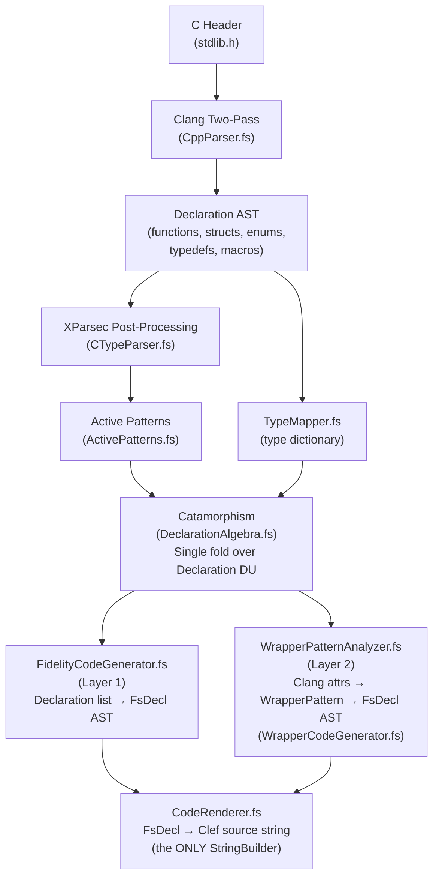

# Farscape Architecture Overview

## Purpose

Farscape generates Clef bindings from C headers for the Fidelity native compilation ecosystem. Unlike traditional FFI tools that target runtime interop, Farscape generates code specifically for ahead-of-time native compilation via Composer.

Farscape generates `[<FidelityExtern>]` attributed binding declarations that carry library name and symbol metadata through the entire Composer pipeline: CCS type-checking, Baker saturation, Alex MLIR emission, LLVM compilation.

## Design Principles

### 1. Closed-Loop Fidelity Pipeline

Farscape is not a standalone binding generator. It is one component of a closed-loop system:

```
C Headers → Farscape → [<FidelityExtern>] declarations → CCS → Baker → Alex → MLIR → LLVM → native binary
```

`[<FidelityExtern>]` carries library name + symbol through the PSG so Alex can emit MLIR with `fidelity.binding_strategy` and `fidelity.library_name` attributes, and the linker auto-collects flags (`-lc`, `-lwayland-client`, etc.).

### 2. Clang-Powered Parsing with XParsec Post-Processing

Farscape uses **clang** for robust C header parsing via a two-pass strategy (JSON AST + macro extraction). XParsec parser combinators handle **post-processing**: decomposing C type strings, classifying macro values, and parsing numeric literals from clang's output.

### 3. Four Architectural Patterns

Every module in Farscape is built from one of four patterns:

| Pattern | Module | Purpose |
|---------|--------|---------|
| **XParsec Parsers** | `CTypeParser.fs` | Decompose C type strings, parse macros and numeric literals |
| **Active Patterns** | `ActivePatterns.fs` | Classify types, filter macros, quote Clef keywords |
| **Catamorphism** | `DeclarationAlgebra.fs` | Single fold over Declaration DU; the ONLY traversal |
| **Typed Code AST** | `CodeAST.fs` + `CodeRenderer.fs` | FsDecl tree → F# source (the ONLY StringBuilder) |

### 4. Two-Layer Binding Model

- **Layer 1**: `[<FidelityExtern>]` binding declarations with `Unchecked.defaultof<T>` bodies. Alex provides platform-specific MLIR implementations.
- **Layer 2** (implemented): Idiomatic Clef wrappers with Result types, null checking, error handling. Driven by 12 clang attribute types and 7 return semantic patterns. CLI: `--output-mode fidelity-wrappers`

Both layers compile to zero-overhead native code via type erasure. No BCL dependencies in generated code.

### 5. Deterministic Output

Generated Clef source is byte-identical across runs. No hash-dependent ordering, no mutable state in the generation pipeline.

## Pipeline Architecture



## Core Modules

### CppParser.fs: Clang Two-Pass Parsing

Parses C headers using clang in two passes:

1. **Pass 1 (JSON AST)**: `clang -Xclang -ast-dump=json` extracts functions, structs, enums, typedefs, classes, namespaces
2. **Pass 2 (Macro extraction)**: `clang -dM -E` extracts `#define` macros

Produces a `Declaration` discriminated union:

```fsharp
type Declaration =
    | Function of FunctionDecl
    | Struct of StructDecl
    | Enum of EnumDecl
    | Typedef of TypedefInfo
    | Macro of MacroDecl
    | Namespace of NamespaceDecl
    | Class of ClassDecl
```

### CTypeParser.fs: XParsec Post-Processing

XParsec parsers for C type strings and macro values, using the generic class pattern:

```fsharp
type Parsers<'Input, 'InputSlice ...>() =
    static let pQualifier = choice [ stringReturn "const " (); ... ]
    static let pCType =
        parser {
            do! skipMany pQualifier
            let! firstWord = pTypeWord
            let! restWords = many (spaces1 >>. pTypeWord)
            let! stars = many (skipChar '*')
            return { BaseType = ...; PointerDepth = stars.Length }
        }
    static member CType = pCType

type private P = Parsers<ReadableString, ReadableStringSlice>
```

Provides four public API functions:
- `tryParseCType`: C type string → `CTypeInfo` (base type + pointer depth)
- `parseMacroLine`: `#define` line → `MacroDecl`
- `tryParseInteger`: decimal/hex string → `int64`
- `tryParseArraySize`: `"uint32_t[4]"` → `4`

### ActivePatterns.fs: Type Classification

Active patterns backed by XParsec parsers:

```fsharp
// C type decomposition
let (|ParsedCType|_|) (s: string) : CTypeInfo option = CTypeParser.tryParseCType s

let (|CharPointer|VoidPointer|TypedPointer|ValueType|) (info: CTypeInfo) =
    if info.PointerDepth > 0 then
        if info.BaseType.EndsWith("char") then CharPointer
        elif info.BaseType = "void" then VoidPointer
        else TypedPointer info.BaseType
    else ValueType info.BaseType

// Macro classification
let (|CompilerBuiltin|InternalMacro|PredefinedMacro|UserMacro|) (name: string) = ...

// Numeric parsing
let (|IntegerLiteral|_|) (s: string) : int64 option = CTypeParser.tryParseInteger s

// F# keyword quoting
let (|FSharpKeyword|CleanName|) (name: string) = ...
```

### DeclarationAlgebra.fs: Catamorphism

A fold algebra over the Declaration DU; the single, canonical traversal:

```fsharp
type DeclarationAlgebra<'R> = {
    OnFunction:  FunctionDecl  -> 'R
    OnStruct:    StructDecl    -> 'R
    OnEnum:      EnumDecl      -> 'R
    OnTypedef:   TypedefInfo   -> 'R
    OnMacro:     MacroDecl     -> 'R
    OnNamespace: NamespaceDecl -> 'R
    OnClass:     ClassDecl     -> 'R
}

let cataDeclarations (algebra: DeclarationAlgebra<'R>) (decls: Declaration list) : 'R list =
    decls |> List.map (fun decl ->
        match decl with
        | Declaration.Function f -> algebra.OnFunction f
        | Declaration.Struct s   -> algebra.OnStruct s
        | ...)
```

Pre-built algebras: `typedefAlgebra` (extract typedef pairs), `structNameAlgebra` (extract struct names).

### CodeAST.fs: Typed Code AST

Typed representation of generated Clef code:

```fsharp
type FsType = Named of string | Generic of string * FsType | Unit
type FsExpr =
    | DefaultOf of FsType                    // Layer 1: Unchecked.defaultof<T>
    | FunctionCall | IfThenElse | ResultOk   // Layer 2: wrapper constructs
    | ResultError | LetIn | Comparison | ... // (see CodeAST.fs for full list)
type FsDecl =
    | Module of name: string * comment: string * decls: FsDecl list
    | XmlDoc of text: string
    | LetBinding of name: string * params': FsParam list * returnType: FsType * body: FsExpr
    | LiteralBinding of name: string * value: string
    | RecordType of name: string * fields: (string * FsType) list * doc: string option
    | EnumType of name: string * values: (string * int64) list * doc: string option
    | Comment of text: string
    | BlankLine
```

### CodeRenderer.fs: Single Renderer

The ONLY `StringBuilder` in Farscape. Converts `FsDecl` tree to Clef source string:

```fsharp
let render (decl: FsDecl) : string =
    let sb = StringBuilder()
    renderDecl sb 0 decl
    sb.ToString().TrimEnd() + "\n"
```

### FidelityCodeGenerator.fs: Orchestration

Wires everything together using one catamorphism pass:

1. Build typedef resolution map (catamorphism + pure recursive chain resolution)
2. Categorize declarations via `generationAlgebra` (one pass)
3. Assemble categories into `FsDecl` list
4. Wrap in `FsDecl.Module`
5. Render via `CodeRenderer.render`

### TypeMapper.fs: NTU Type Dictionary

PlatformABI-parameterized mapping from C type names to NTU Clef type names. C `int`/`long` widths are resolved at generation time per the target platform's ABI:

```fsharp
let getFSharpType (model: PlatformABI) (cppType: string) : string =
    let typeMap = typeMaps.[model]  // Cached per ABI variant
    let cleaned = cleanTypeName cppType
    if typeMap.ContainsKey(cleaned) then typeMap.[cleaned]
    elif ...
```

LP64: `long → int64`. LLP64/ILP32: `long → int32`. Pointer-width types (`size_t`, `intptr_t`) stay `unativeint`/`nativeint` regardless of platform.

## Output Modes

### Fidelity Mode

Generates `[<FidelityExtern>]` binding declarations for the Composer native compilation pipeline:

```fsharp
module Fidelity.libc.Memory

// Generated by Farscape, Fidelity binding for libc

    /// C signature: void * memcpy(void *restrict __dest, const void *restrict __src, size_t __n)
    [<FidelityExtern("libc", "memcpy")>]
    let memcpy (dest: nativeint) (src: nativeint) (n: unativeint) : nativeint =
        Unchecked.defaultof<nativeint>
```

## File Compile Order

```xml
<Compile Include="Types.fs" />
<Compile Include="CppParser.fs" />
<Compile Include="TypeMapper.fs" />
<Compile Include="CTypeParser.fs" />
<Compile Include="ActivePatterns.fs" />
<Compile Include="PilotTypes.fs" />
<Compile Include="DeclarationAlgebra.fs" />
<Compile Include="PilotAnalyzer.fs" />
<Compile Include="PilotSerializer.fs" />
<Compile Include="WrapperTypes.fs" />
<Compile Include="WrapperPatternAnalyzer.fs" />
<Compile Include="CodeAST.fs" />
<Compile Include="CodeRenderer.fs" />
<Compile Include="FidelityCodeGenerator.fs" />
<Compile Include="WrapperCodeGenerator.fs" />
<Compile Include="ErrnoModuleGenerator.fs" />
<Compile Include="BindingGenerator.fs" />
```

Key constraint: `CppParser.fs` compiles before `CTypeParser.fs`; the XParsec parsers are in a separate module downstream of the parser types. `Types.fs` provides shared types (`PlatformABI`) used by `TypeMapper.fs` for resolving C type widths.

## Test Architecture

Tests are organized as **module-aligned test files** that mirror the source module structure. Each test file covers one functional area of Farscape, preventing monolithic test files that become difficult to navigate and maintain.

### Principle

Test modules track with source modules 1:1 where coverage exists. Adding a new binding surface (HIP, DRM/GBM, Wayland) means adding a new test file, not growing an existing one. Closely related concerns (e.g., errno wrapper tests alongside general wrapper tests) may share a file as a sub-module, but unrelated test areas stay separate.

### Structure

```
tests/Farscape.Tests/
├── TestHelpers.fs                  ← Shared test factories (mkFunc, mkDecl, etc.)
├── CTypeParserTests.fs             ← XParsec C type string parsers
├── ActivePatternsTests.fs          ← Active pattern decomposition
├── DeclarationAlgebraTests.fs      ← Catamorphism over Declaration DU
├── CodeRendererTests.fs            ← Typed AST → Clef source rendering
├── FidelityCodeGeneratorTests.fs   ← Layer 1 FidelityExtern generation
├── PilotAnalyzerTests.fs           ← Prefix analysis and declaration filtering
├── PilotSerializerTests.fs         ← TOML round-trip (includes ErrorConventionToml)
├── WrapperPatternAnalyzerTests.fs  ← Attribute mapping and return semantic inference
├── WrapperCodeGeneratorTests.fs    ← Layer 2 wrapper generation (includes ErrnoWrapper)
├── ErrnoModuleGeneratorTests.fs    ← Errno infrastructure generation
├── DocumentationExtractionTests.fs ← Comment/doc extraction (includes RawHeaderComment)
├── Program.fs                      ← xUnit entry point
```

### Shared Test Factories

`TestHelpers.fs` provides consolidated construction helpers (`mkFunc`, `mkFuncWithAttrs`, `mkFuncWithDoc`, `mkDecl`, `mkAttr`, etc.) that eliminate duplication across test modules. Variant signatures serve different test needs: basic construction, construction with attributes, construction with documentation.

### Guidelines for New Test Files

- Name the file `{SourceModule}Tests.fs` to match the source module it covers
- Use `module Farscape.Tests.{ModuleName}` as the top-level module declaration
- Open `TestHelpers` for shared construction helpers rather than defining local duplicates
- Closely related sub-concerns use `module SubName =` within the parent file
- Add the new `<Compile Include="...Tests.fs" />` entry to the `.fsproj` before `Program.fs`

## Core Infrastructure Under Development

These are not optional future features. They are what closes the Fidelity system loop:

1. **`[<FidelityExtern>]` attributes**: Binding metadata carried through the PSG pipeline. Currently Alex infers from naming conventions; the attribute makes it explicit.
2. **BAREWire memory/type layout capture**: Reading header AST for precise struct layout, access constraints, memory regions. Core to memory safety guarantees.
3. **CMSIS qualifier extraction**: `__I`/`__O`/`__IO` → `AccessKind` for hardware-enforced access constraints.

## Roadmap

- Static binding: LLVM LTO cross-language inlining (current focus: libc dynamic binding)
- C++ support: Plugify ABI intelligence for virtual tables, templates, RAII
- Migration path toward Atelier Transcribe/Transpose feature

## Related Documents

- [BAREWire Integration](./02_BAREWire_Integration.md): Hardware descriptor generation design
- [CCS Integration](./03_fsnative_Integration.md): Native type system coordination
- [XParsec Architecture](./04_XParsec_Architecture.md): How Farscape uses XParsec throughout
- [Wrapper Generation](./05_Wrapper_Generation.md): Layer 2 idiomatic Clef wrapper generation
