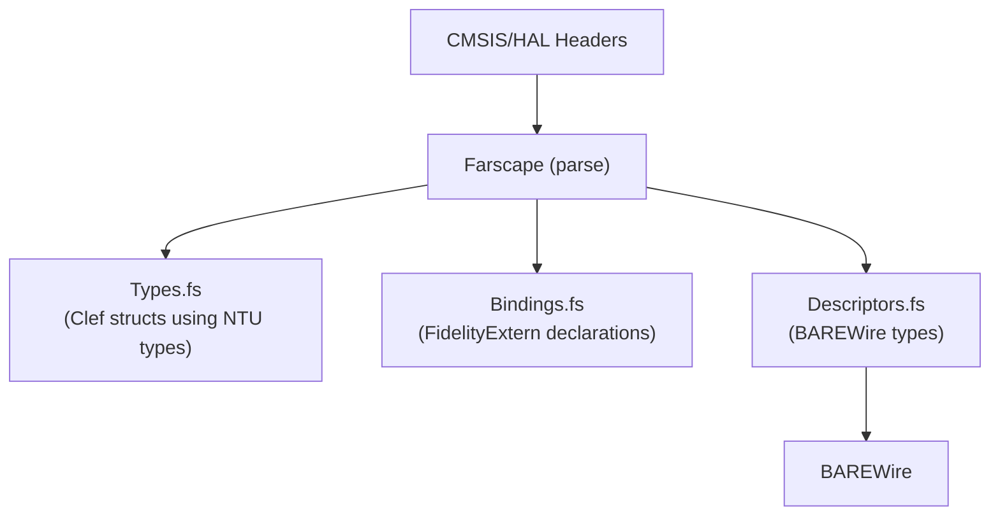

# BAREWire Integration

Farscape generates BAREWire hardware descriptors from parsed C headers. This document describes how Farscape populates BAREWire types and how the generated descriptors are consumed by Composer/Alex.

## Core Infrastructure

Reading header AST to capture precise memory/type layout is foundational to Fidelity's memory safety guarantees. Without BAREWire descriptors carrying mapped layout into the codebase, there is no closed-loop memory safety story. This is core infrastructure, not an optional enhancement.

## Dependency Chain



Farscape takes BAREWire as a dependency. The memory descriptor types live in BAREWire; Farscape populates them from parsed headers. BAREWire development advances in parallel to provide:

| BAREWire Type | Purpose |
|---------------|---------|
| `PeripheralDescriptor` | Complete peripheral definition |
| `PeripheralLayout` | Register set structure |
| `FieldDescriptor` | Individual register definition |
| `AccessKind` | Read/Write constraints |
| `MemoryRegionKind` | Memory classification |
| `BitFieldDescriptor` | Sub-register fields |
| `RegisterType` | Register data types |

See [BAREWire Hardware Descriptors](~/repos/BAREWire/docs/08%20Hardware%20Descriptors.md) for type definitions.

## Descriptor Generation Pipeline

### Stage 1: Header Parsing

Farscape's clang two-pass parser (with XParsec post-processing) extracts C struct definitions:

```c
// Input: CMSIS header
typedef struct {
    __IO uint32_t MODER;
    __IO uint32_t OTYPER;
    __I  uint32_t IDR;
    __IO uint32_t ODR;
    __O  uint32_t BSRR;
} GPIO_TypeDef;
```

The parser produces an intermediate representation:

```fsharp
type CStructDef = {
    Name: string option           // Some "GPIO_TypeDef"
    Fields: CFieldDef list        // [MODER; OTYPER; IDR; ODR; BSRR]
}

type CFieldDef = {
    Qualifiers: CQualifier list   // [__IO], [__I], or [__O]
    Type: CType                   // uint32_t
    Name: string                  // "MODER"
    ArraySize: int option         // None for scalars
}

type CQualifier =
    | Volatile
    | Const
    | CMSIS_I    // __I - volatile const (read-only)
    | CMSIS_O    // __O - volatile (write-only)
    | CMSIS_IO   // __IO - volatile (read-write)
```

### Stage 2: Macro Extraction

Peripheral instance base addresses come from `#define` macros:

```c
// Input
#define GPIOA_BASE 0x48000000UL
#define GPIOB_BASE 0x48000400UL
#define GPIOA ((GPIO_TypeDef *) GPIOA_BASE)
#define GPIOB ((GPIO_TypeDef *) GPIOB_BASE)
```

Farscape extracts:

```fsharp
type CPeripheralInstance = {
    InstanceName: string      // "GPIOA"
    TypeName: string          // "GPIO_TypeDef"
    BaseAddress: unativeint   // 0x48000000un
}
```

### Stage 3: Layout Calculation

> **Read `docs/14_Binding_Generation_Gaps.md` §2 before implementing against this section.**
> The natural-alignment arithmetic below cannot be reproduced by an emitted Clef record:
> records lower packed with no alignment padding, `int`/`uint` are register width, and
> nested struct fields lower through memref descriptors rather than inline. A descriptor
> computed here and a record emitted alongside it will disagree about every offset after the
> first mixed-width field. The conclusion reached there is that such structs should emit a
> layout module — literal offsets and typed accessors — rather than a record.

Farscape calculates field offsets and struct size:

```fsharp
let calculateLayout (fields: CFieldDef list) : PeripheralLayout =
    let mutable offset = 0
    let mutable maxAlign = 1

    let fieldDescriptors = [
        for field in fields do
            let (size, align) = getTypeMetrics field.Type
            offset <- alignUp offset align
            maxAlign <- max maxAlign align

            yield {
                Name = field.Name
                Offset = offset
                Type = mapCTypeToRegisterType field.Type
                Access = mapQualifiersToAccess field.Qualifiers
                BitFields = None
                Documentation = None
            }

            offset <- offset + size
    ]

    {
        Size = alignUp offset maxAlign
        Alignment = maxAlign
        Fields = fieldDescriptors
    }
```

### Stage 4: Descriptor Assembly

All parsed information is assembled into a `PeripheralDescriptor`:

```fsharp
let generatePeripheralDescriptor
    (structDef: CStructDef)
    (instances: CPeripheralInstance list)
    : PeripheralDescriptor =

    {
        Name = extractFamilyName structDef.Name  // "GPIO" from "GPIO_TypeDef"
        Instances =
            instances
            |> List.map (fun i -> i.InstanceName, i.BaseAddress)
            |> Map.ofList
        Layout = calculateLayout structDef.Fields
        MemoryRegion = Peripheral  // CMSIS peripherals are always volatile
    }
```

## CMSIS Qualifier Mapping

The critical mapping from CMSIS qualifiers to `AccessKind`:

| CMSIS | C Definition | AccessKind | Meaning |
|-------|--------------|------------|---------|
| `__I` | `volatile const` | `ReadOnly` | Hardware state; writes undefined |
| `__O` | `volatile` | `WriteOnly` | Trigger register; reads undefined |
| `__IO` | `volatile` | `ReadWrite` | Normal volatile register |

### Implementation

```fsharp
let mapQualifiersToAccess (qualifiers: CQualifier list) : AccessKind =
    match qualifiers with
    | q when List.contains CMSIS_I q -> ReadOnly
    | q when List.contains CMSIS_O q -> WriteOnly
    | q when List.contains CMSIS_IO q -> ReadWrite
    | q when List.contains Const q && List.contains Volatile q -> ReadOnly
    | q when List.contains Volatile q -> ReadWrite
    | _ -> ReadWrite  // Default for non-volatile (rare in CMSIS)
```

### Why This Matters

Access constraints are **hardware-enforced**. The generated `AccessKind` informs:

1. **CCS type checking**: Fields carry access constraints through the type system
2. **Alex MLIR emission**: Prevents invalid read-modify-write on write-only registers
3. **Compile-time safety**: Attempts to read a write-only register produce compile errors

Example error:

```fsharp
// Clef code (using Farscape-generated bindings)
let value = gpio.BSRR  // Attempt to read write-only register

// Compile error:
// FS8001: Cannot read from write-only pointer 'BSRR'
```

## Output Format

### Descriptors.fs

Farscape generates a complete Clef module:

```fsharp
namespace CMSIS.STM32L5.Descriptors

open BAREWire.Hardware

/// GPIO peripheral family descriptor
let gpioDescriptor: PeripheralDescriptor = {
    Name = "GPIO"
    Instances = Map.ofList [
        "GPIOA", 0x48000000un
        "GPIOB", 0x48000400un
        "GPIOC", 0x48000800un
        "GPIOD", 0x48000C00un
        "GPIOE", 0x48001000un
        "GPIOF", 0x48001400un
        "GPIOG", 0x48001800un
        "GPIOH", 0x48001C00un
    ]
    Layout = {
        Size = 0x400
        Alignment = 4
        Fields = [
            { Name = "MODER";   Offset = 0x00; Type = U32; Access = ReadWrite; BitFields = None; Documentation = Some "Mode register" }
            { Name = "OTYPER";  Offset = 0x04; Type = U32; Access = ReadWrite; BitFields = None; Documentation = Some "Output type register" }
            { Name = "OSPEEDR"; Offset = 0x08; Type = U32; Access = ReadWrite; BitFields = None; Documentation = Some "Output speed register" }
            { Name = "PUPDR";   Offset = 0x0C; Type = U32; Access = ReadWrite; BitFields = None; Documentation = Some "Pull-up/pull-down register" }
            { Name = "IDR";     Offset = 0x10; Type = U32; Access = ReadOnly;  BitFields = None; Documentation = Some "Input data register" }
            { Name = "ODR";     Offset = 0x14; Type = U32; Access = ReadWrite; BitFields = None; Documentation = Some "Output data register" }
            { Name = "BSRR";    Offset = 0x18; Type = U32; Access = WriteOnly; BitFields = None; Documentation = Some "Bit set/reset register" }
            { Name = "LCKR";    Offset = 0x1C; Type = U32; Access = ReadWrite; BitFields = None; Documentation = Some "Configuration lock register" }
            { Name = "AFRL";    Offset = 0x20; Type = U32; Access = ReadWrite; BitFields = None; Documentation = Some "Alternate function low register" }
            { Name = "AFRH";    Offset = 0x24; Type = U32; Access = ReadWrite; BitFields = None; Documentation = Some "Alternate function high register" }
            { Name = "BRR";     Offset = 0x28; Type = U32; Access = WriteOnly; BitFields = None; Documentation = Some "Bit reset register" }
        ]
    }
    MemoryRegion = Peripheral
}

/// All descriptors for STM32L5 family
let allDescriptors = [
    gpioDescriptor
    // ... more peripherals
]
```

## Consumption by Composer/Alex

### Memory Catalog

Alex uses the descriptors to build a memory catalog:

```fsharp
type MemoryCatalog = {
    Peripherals: Map<string, PeripheralDescriptor>
    AddressToPeripheral: Map<unativeint, string * string>
}

let buildCatalog (descriptors: PeripheralDescriptor list) : MemoryCatalog =
    let peripherals = descriptors |> List.map (fun d -> d.Name, d) |> Map.ofList
    let addressMap = [
        for d in descriptors do
            for (instance, addr) in Map.toSeq d.Instances do
                yield addr, (d.Name, instance)
    ] |> Map.ofList
    { Peripherals = peripherals; AddressToPeripheral = addressMap }
```

### MLIR Generation

When Alex encounters peripheral access, it uses descriptor info:

```fsharp
// Alex sees: gpio.ODR <- 0x20u

// 1. Look up field in descriptor
let field = gpioDescriptor.Layout.Fields |> List.find (fun f -> f.Name = "ODR")

// 2. Verify access is legal
match field.Access with
| ReadOnly -> failwith "Cannot write to read-only register"
| WriteOnly | ReadWrite -> ()  // OK

// 3. Generate volatile store with correct offset
let baseAddr = Map.find "GPIOA" gpioDescriptor.Instances
let ptr = builder.BuildIntToPtr baseAddr
let fieldPtr = builder.BuildGEP ptr [| int64 field.Offset |]
builder.BuildVolatileStore value fieldPtr
```

### Tree-Shaking

Only referenced descriptors are included in final binary:

1. Reachability analysis identifies used peripherals
2. Unused peripheral descriptors are eliminated
3. Final binary contains minimal metadata

## Bit Field Extraction

CMSIS headers define bit fields via macros:

```c
#define USART_CR1_UE_Pos    0U
#define USART_CR1_UE_Msk    (0x1UL << USART_CR1_UE_Pos)
#define USART_CR1_UE        USART_CR1_UE_Msk

#define USART_CR1_RE_Pos    2U
#define USART_CR1_RE_Msk    (0x1UL << USART_CR1_RE_Pos)
#define USART_CR1_RE        USART_CR1_RE_Msk
```

Farscape extracts these into `BitFieldDescriptor`:

```fsharp
{ Name = "UE"; Position = 0; Width = 1; Access = ReadWrite }
{ Name = "RE"; Position = 2; Width = 1; Access = ReadWrite }
```

## Development Sequence

### Immediate (requires BAREWire types)

1. BAREWire adds types to `src/Core/Hardware/`
2. Farscape references BAREWire
3. Farscape outputs `PeripheralDescriptor` instances via the generation pipeline

### Near-term

1. Macro extraction for base addresses
2. CMSIS qualifier recognition (`__I`, `__O`, `__IO`)
3. Struct layout calculation

### Subsequent

1. Bit field extraction from `_Pos`/`_Msk` macros
2. Documentation extraction from comments
3. Peripheral dependency relationships

## Related Documents

| Document | Location |
|----------|----------|
| BAREWire Hardware Descriptors | `~/repos/BAREWire/docs/08 Hardware Descriptors.md` |
| CCS Integration | `./03_fsnative_Integration.md` |
| Composer Memory Interlock | `~/repos/Firefly/docs/Memory_Interlock_Requirements.md` |
