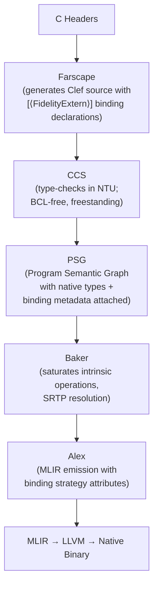

# CCS Integration

Farscape generates Clef binding source files that feed into the Composer compilation pipeline. The first consumer of this output is **CCS (Clef Compiler Services)**, a complete, standalone native type checker operating in the Native Type Universe (NTU).

## The Closed-Loop Pipeline



## What CCS Is

CCS is the native type checker for Composer, a **complete compiler service** with:

- **Native Type Universe (NTU)**: NTUKind types (`NTUint`, `NTUuint`, `NTUptr<'T>`, `NTUsize`), BCL-free
- **SRTP resolution**: Statically resolved type parameters via native WitnessResolution
- **Union-Find constraint solving**: Type inference with occurs check
- **Expression checking**: Full SynExpr → SemanticGraph construction with types attached during construction
- **Intrinsic resolution**: Layer 1 operations (Sys.write, NativePtr.*, Array.*) that CCS emits directly as MLIR operations

CCS lives at `~/repos/fsnative/` and is registered as the `CCS` Serena project.

## What Farscape Generates

### `[<FidelityExtern>]` Attributed Binding Declarations (Core Infrastructure)

```fsharp
[<FidelityExtern("libc", "memcpy")>]
let memcpy (dest: nativeint) (src: nativeint) (n: nativeint) : nativeint =
    NativeDefault.zeroed ()
```

CCS recognizes the `[<FidelityExtern>]` attribute and carries library name + symbol through the PSG. Baker recognizes the `NativeDefault.zeroed ()` pattern and elaborates it with intrinsic metadata. Alex emits MLIR with `fidelity.binding_strategy` and `fidelity.library_name` attributes. The linker auto-collects all referenced libraries and generates appropriate flags (`-lc`, `-lwayland-client`, etc.).

**Current state** (verified 2026-08-03): the attribute **is** emitted — `FidelityCodeGenerator.fs:221, 279` and `ErrnoModuleGenerator.fs:91` build it on every generated extern. Earlier revisions of this document described it as pending; it is not. Adding `[<FidelityExtern>]` was core infrastructure that closes the pipeline loop.

## Sliced Package Architecture

Farscape generates categorized, source-based packages from C headers:

| Package | C Headers | Key Functions |
|---------|-----------|---------------|
| `Fidelity.libc.IO` | `<unistd.h>` | read, write, open, close, lseek, pipe |
| `Fidelity.libc.Memory` | `<string.h>` | memcpy, memset, strlen, strcpy |
| `Fidelity.libc.Alloc` | `<stdlib.h>` | malloc, free, calloc, realloc, abort, exit |

Reachability analysis in the pipeline means only functions actually called get MLIR emissions. Unused bindings cost zero in the final binary.

## Quotation Semantic Carriers (Core Infrastructure)

For embedded targets (CMSIS peripherals), Farscape generates quotation semantic carriers that carry memory layout and access constraint information through the pipeline:

```fsharp
let gpioQuotation: Expr<PeripheralDescriptor> = <@
    { Name = "GPIO"
      Instances = Map.ofList [("GPIOA", 0x48000000un)]
      Layout = { Size = 0x400; Alignment = 4; Fields = gpioFields }
      MemoryRegion = Peripheral }
@>
```

CCS nanopasses decompose these quotations to attach volatile semantics and access constraints to PSG nodes.

## CMSIS Access Constraints (Core Infrastructure)

Farscape maps `__I`/`__O`/`__IO` qualifiers to access constraints carried through the pipeline:

| CMSIS | C Definition | Pipeline Effect |
|-------|--------------|-----------------|
| `__I` | `volatile const` | CCS marks read-only, Alex emits volatile load only |
| `__O` | `volatile` | CCS marks write-only, Alex emits volatile store only |
| `__IO` | `volatile` | CCS marks read-write, Alex emits volatile load/store |

These constraints are enforced at compile time through NTU's type system, CCS's constraint checking, and Baker's intrinsic elaboration.

## Alex's Role

Alex works ONLY with MLIR. It does not work with Clef source directly. Alex receives binding metadata through MLIR attributes:

- `fidelity.binding_strategy`: static or dynamic
- `fidelity.library_name`: library identifier for linker flag collection

For the current focus (libc dynamic binding), Alex emits dynamic binding MLIR. Static binding (LLVM LTO cross-language inlining) is on the roadmap.

## Current State vs Target

| Aspect | Current | Target |
|--------|---------|--------|
| Output format | `NativeDefault.zeroed ()` binding declarations | `[<FidelityExtern>]` attributed binding declarations |
| Library metadata | None: Alex infers from symbol names | Library name + symbol carried through PSG |
| CMSIS support | Structs/enums parsed, qualifiers not extracted | Full qualifier → access constraint mapping |
| Linker flags | Hard-coded | Auto-collected from `fidelity.library_name` attributes |
| Distribution | Manual file generation | Source-based packages via frgo.dev |

## Related Documents

| Document | Location |
|----------|----------|
| Architecture Overview | `./01_Architecture_Overview.md` |
| BAREWire Integration | `./02_BAREWire_Integration.md` |
| XParsec Architecture | `./04_XParsec_Architecture.md` |
| CCS Architecture | `~/repos/fsnative/` (Serena memory: `ccs_architecture`) |
