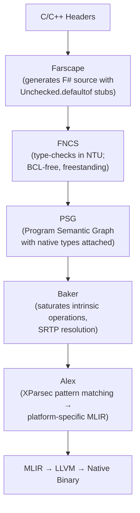

# FNCS Integration

Farscape generates F# binding source files that feed into the Firefly compilation pipeline. The first consumer of this output is **FNCS (F# Native Compiler Services)**, a complete, standalone native type checker operating in the Native Type Universe (NTU).

## The Pipeline



## What FNCS Is

FNCS is the native type checker for Firefly, a **complete compiler service** with:

- **Native Type Universe (NTU)**: NTUKind types (`NTUint`, `NTUuint`, `NTUptr<'T>`, `NTUsize`), BCL-free
- **SRTP resolution**: Statically resolved type parameters via native WitnessResolution
- **Union-Find constraint solving**: Type inference with occurs check
- **Expression checking**: Full SynExpr → SemanticGraph construction with types attached during construction
- **Intrinsic resolution**: Layer 1 operations (Sys.write, NativePtr.*, Array.*) that FNCS emits directly as MLIR operations

FNCS lives at `~/repos/fsnative/` and is registered as the `FNCS` Serena project.

## What Farscape Generates

Farscape currently generates **Fidelity binding stubs**: F# source files with `Unchecked.defaultof<T>` bodies:

```fsharp
module Fidelity.libc.Memory

    /// void * memcpy(void *restrict __dest, const void *restrict __src, size_t __n)
    let memcpy (dest: nativeint) (src: nativeint) (n: nativeint) : nativeint =
        Unchecked.defaultof<nativeint>
```

FNCS type-checks this as valid F# source. Baker recognizes the `Unchecked.defaultof` pattern and elaborates it with intrinsic metadata. Alex then emits platform-specific MLIR for the call.

## Sliced Package Architecture

Farscape generates categorized, source-based packages from C headers:

| Package | C Headers | Key Functions |
|---------|-----------|---------------|
| `Fidelity.libc.IO` | `<unistd.h>` | read, write, open, close, lseek, pipe |
| `Fidelity.libc.Memory` | `<string.h>` | memcpy, memset, strlen, strcpy |
| `Fidelity.libc.Alloc` | `<stdlib.h>` | malloc, free, calloc, realloc, abort, exit |

Reachability analysis in the pipeline means only functions actually called get MLIR emissions. Unused bindings cost zero in the final binary.

## Planned: `[<FidelityExtern>]` Attributes

The target architecture adds binding metadata that travels through the entire pipeline:

```fsharp
// Future: Farscape generates with attributes
[<FidelityExtern("libc", "memcpy")>]
let memcpy (dest: nativeint) (src: nativeint) (n: nativeint) : nativeint =
    Unchecked.defaultof<nativeint>
```

FNCS recognizes the `[<FidelityExtern>]` attribute and carries library name + symbol through the PSG. Alex emits MLIR with `fidelity.binding_strategy` and `fidelity.library_name` attributes. The linker collects all referenced libraries and generates appropriate flags (`-lc`, `-lwayland-client`, etc.).

## Planned: Quotation Semantic Carriers

For embedded targets (CMSIS peripherals), Farscape will generate quotation semantic carriers that carry memory layout and access constraint information:

```fsharp
// Future: Farscape generates for CMSIS targets
let gpioQuotation: Expr<PeripheralDescriptor> = <@
    { Name = "GPIO"
      Instances = Map.ofList [("GPIOA", 0x48000000un)]
      Layout = { Size = 0x400; Alignment = 4; Fields = gpioFields }
      MemoryRegion = Peripheral }
@>
```

FNCS nanopasses can decompose these quotations to attach volatile semantics and access constraints to PSG nodes.

## CMSIS Access Constraints

When CMSIS qualifier extraction is implemented, Farscape will map `__I`/`__O`/`__IO` qualifiers to access constraints carried through the pipeline:

| CMSIS | C Definition | Pipeline Effect |
|-------|--------------|-----------------|
| `__I` | `volatile const` | FNCS marks read-only, Alex emits volatile load only |
| `__O` | `volatile` | FNCS marks write-only, Alex emits volatile store only |
| `__IO` | `volatile` | FNCS marks read-write, Alex emits volatile load/store |

These constraints are enforced at compile time through NTU's type system, FNCS's constraint checking, and Baker's intrinsic elaboration.

## Current State vs Target

| Aspect | Current | Target |
|--------|---------|--------|
| Output format | `Unchecked.defaultof` stubs | `[<FidelityExtern>]` attributed stubs |
| Library metadata | None: Alex infers from symbol names | Library name + symbol carried through PSG |
| CMSIS support | Structs/enums parsed, qualifiers not extracted | Full qualifier → access constraint mapping |
| Linker flags | Hard-coded in Codegen.fs | Auto-collected from `fidelity.library_name` attributes |
| Distribution | Manual file generation | Source-based packages via frgo.dev |

## Related Documents

| Document | Location |
|----------|----------|
| Architecture Overview | `./01_Architecture_Overview.md` |
| BAREWire Integration | `./02_BAREWire_Integration.md` |
| XParsec Architecture | `./04_XParsec_Architecture.md` |
| FNCS Architecture | `~/repos/fsnative/` (Serena memory: `fncs_architecture`) |
| Farscape libc Architecture | Firefly Serena memory: `farscape_libc_binding_architecture` |
