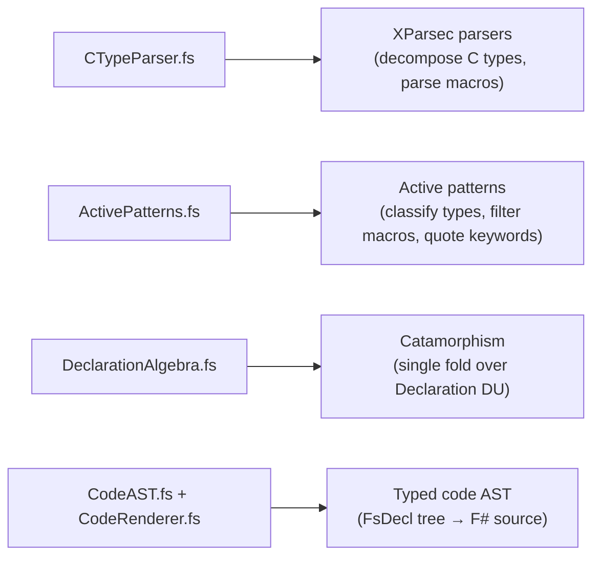
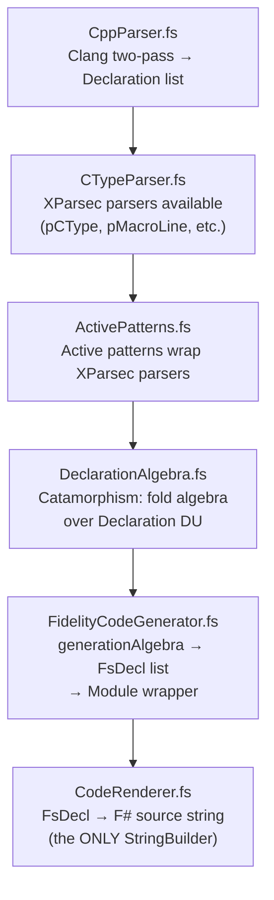

# XParsec Architecture in Farscape

Farscape uses XParsec parser combinators throughout its pipeline for **post-processing** C type strings, macro values, and numeric literals produced by clang's two-pass header parsing. This document describes the four F# patterns that structure the codebase.

## The Four Patterns



## Pattern 1: XParsec Parser Combinators (`CTypeParser.fs`)

### The Generic Class Pattern

Farscape follows the same XParsec pattern as `XParsec.Json.JsonParsers` — a generic class with `static let` bindings and `static member` accessors:

```fsharp
type Parsers<'Input, 'InputSlice
    when 'Input :> IReadable<char, 'InputSlice>
    and 'InputSlice :> IReadable<char, 'InputSlice>>() =

    static let pQualifier =
        choice [
            stringReturn "const " ()
            stringReturn "restrict " ()
            stringReturn "volatile " ()
            // ...
        ]

    static let pCType =
        parser {
            do! skipMany pQualifier
            let! firstWord = pTypeWord
            let! restWords = many (spaces1 >>. pTypeWord)
            let! stars = many (skipChar '*')
            return { BaseType = ...; PointerDepth = stars.Length }
        }

    static member CType = pCType
```

Concrete instantiation: `type private P = Parsers<ReadableString, ReadableStringSlice>`

### What Gets Parsed

| Parser | Input | Output |
|--------|-------|--------|
| `pCType` | `"const char *"` | `{ BaseType = "char"; PointerDepth = 1 }` |
| `pMacroLine` | `"#define FOO 42"` | `MacroDecl { Name = "FOO"; Kind = SimpleValue "42" }` |
| `pIntegerLiteral` | `"0xFF"` | `255L` |
| `pArraySize` | `"uint32_t[4]"` | `4` |

### XParsec API Notes

- `many` returns `ImmutableArray`, not `list` — use `Seq.toList` or `.Length`
- `sepBy` returns `struct (ImmutableArray * ImmutableArray)` — first is items, second is separators
- `manyChars`/`many1Chars` return `string` directly
- ParseResult is matched as `Ok result -> result.Parsed`
- Invocation: `P.CType reader` where `reader = Reader.ofString input ()`

## Pattern 2: Active Patterns (`ActivePatterns.fs`)

Active patterns expose XParsec parsers as F# pattern matching:

### Type Decomposition

```fsharp
let (|ParsedCType|_|) (s: string) : CTypeInfo option =
    CTypeParser.tryParseCType s

let (|CharPointer|VoidPointer|TypedPointer|ValueType|) (info: CTypeInfo) =
    if info.PointerDepth > 0 then
        if info.BaseType.EndsWith("char") then CharPointer
        elif info.BaseType = "void" then VoidPointer
        else TypedPointer info.BaseType
    else ValueType info.BaseType
```

Usage in `FidelityCodeGenerator.fs`:

```fsharp
match cType with
| ParsedCType info ->
    info |> mapTypeInfo (fun baseType ->
        let resolved = resolveType typedefMap baseType
        match resolved with
        | ParsedCType resolvedInfo -> ...
        | _ -> ...)
| _ -> Named (TypeMapper.getFSharpType cType)
```

### Macro Classification

```fsharp
let (|CompilerBuiltin|InternalMacro|PredefinedMacro|UserMacro|) (name: string) =
    if name.StartsWith("__") && name.EndsWith("__") then CompilerBuiltin
    elif name.StartsWith("_") && Char.IsUpper(name.[1]) then InternalMacro
    elif predefinedMacros.Contains(name) then PredefinedMacro
    else UserMacro
```

### Other Active Patterns

- `(|IntegerLiteral|_|)` — decimal/hex integer parsing via XParsec
- `(|FSharpKeyword|CleanName|)` — F# keyword detection + backtick quoting
- `(|ArrayType|_|)` — array size extraction from C type strings

## Pattern 3: Catamorphism (`DeclarationAlgebra.fs`)

A fold algebra over the `CppParser.Declaration` discriminated union. Instead of repeated `List.choose (function | Function f -> ... | _ -> None)` patterns, define an algebra with one function per variant:

```fsharp
type DeclarationAlgebra<'R> = {
    OnFunction:  FunctionDecl  -> 'R
    OnStruct:    StructDecl    -> 'R
    OnEnum:      EnumDecl      -> 'R
    OnTypedef:   TypedefInfo   -> 'R
    OnMacro:     MacroDecl     -> 'R
    OnNamespace: NamespaceDecl -> 'R
    OnClass:     ClassDecl     -> 'R
}

let cataDeclarations (algebra: DeclarationAlgebra<'R>) (decls: Declaration list) : 'R list =
    decls |> List.map (fun decl ->
        match decl with
        | Declaration.Function f -> algebra.OnFunction f
        | ...)
```

### Pre-Built Algebras

- **`typedefAlgebra`** — extracts `(name, underlyingType)` pairs, produces `None` for non-typedefs
- **`structNameAlgebra`** — extracts struct/class names

### Custom Algebras

`FidelityCodeGenerator.fs` defines a `generationAlgebra` that categorizes declarations into enums, structs, functions, and macros in a single pass:

```fsharp
let private generationAlgebra typedefMap : DeclarationAlgebra<DeclGroup> = {
    OnEnum = fun e -> GEnum (generateEnumDecl e)
    OnStruct = fun s -> GStruct (generateStructDecl typedefMap s)
    OnFunction = fun f -> GFunc f
    OnMacro = fun m -> GMacro (generateMacroDeclIfNumeric m)
    OnTypedef = fun _ -> GNone
    OnNamespace = fun _ -> GNone
    OnClass = fun _ -> GNone
}
```

## Pattern 4: Typed Code AST (`CodeAST.fs` + `CodeRenderer.fs`)

Instead of building strings with `StringBuilder`, generation produces `FsDecl` values — typed, inspectable, testable AST nodes.

### The AST Types

```fsharp
type FsType =
    | Named of string              // "int32", "nativeint"
    | Generic of string * FsType   // "nativeptr<byte>"
    | Unit

type FsExpr =
    | DefaultOf of FsType          // Unchecked.defaultof<T>

type FsDecl =
    | Module of name * comment * decls
    | XmlDoc of text
    | Comment of text
    | BlankLine
    | LetBinding of name * params * returnType * body
    | LiteralBinding of name * value
    | RecordType of name * fields * doc
    | EnumType of name * values * doc
```

### The Single StringBuilder

`CodeRenderer.render` is the ONLY `StringBuilder` in Farscape:

```fsharp
let render (decl: FsDecl) : string =
    let sb = StringBuilder()
    renderDecl sb 0 decl
    sb.ToString().TrimEnd() + "\n"
```

Every other module produces `FsDecl` values. The separation means:
- Generation logic is testable without string comparison
- Output format changes only touch `CodeRenderer.fs`
- AST nodes can be inspected, transformed, or serialized

## How It All Flows Together



One traversal. One algebra. One render.
