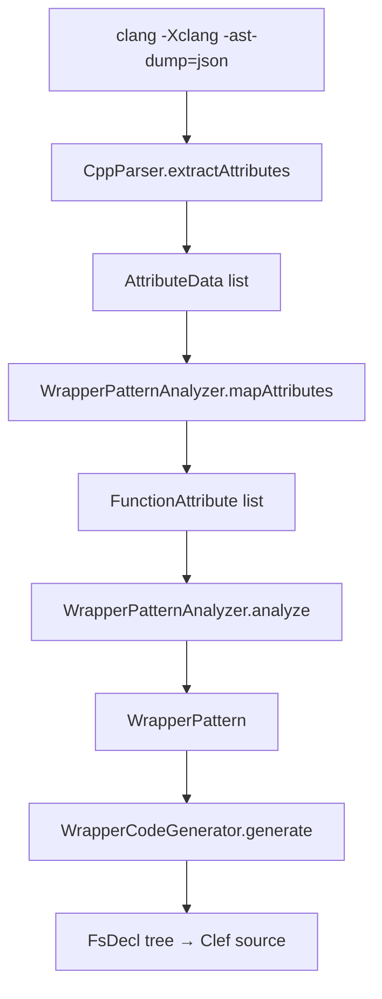

# Layer 2: Idiomatic Clef Wrapper Generation

Farscape implements a **two-layer binding model**. Layer 1 generates `[<FidelityExtern>]` binding declarations with `Unchecked.defaultof<T>` bodies that feed the CCS/Baker/Alex pipeline. Layer 2 generates idiomatic Clef wrappers that call Layer 1 and add error handling, type safety, and null checking. Both layers are implemented and working.

## Two-Layer Architecture

```
Layer 1: Platform.Bindings (raw extern declarations):
    let read (fd: int32) (buf: nativeint) (count: nativeint) : nativeint =
        Unchecked.defaultof<nativeint>

Layer 2: Idiomatic Wrappers (generated by WrapperCodeGenerator):
    let read (fd: int32) (buf: nativeint) (count: nativeint) : Result<nativeint, nativeint> =
        let result = Platform.Bindings.Libc.IO.read fd buf count
        if result >= 0n then Ok result
        else Error result
```

Both layers flow through the same pipeline: CCS → PSG → Baker → Alex → MLIR → LLVM → native binary. The wrapper layer compiles to zero overhead: Result types are erased, comparisons inline, the raw binding call remains. These wrappers target the native pipeline exclusively.

## Clang Attribute-Driven Pattern Selection

Wrapper patterns are **not heuristic guesses**. They are driven by clang's AST attributes, semantic annotations that clang attaches to function declarations based on GCC/clang `__attribute__` specifications in system headers.

### Attribute Extraction Pipeline



### Supported Attributes (12 types)

| Attribute | Signal | Example Functions |
|-----------|--------|-------------------|
| `AllocSizeAttr` | Returns allocated memory | malloc, calloc, realloc |
| `NonNullAttr` | Parameters must not be null | fclose, fread, fwrite |
| `FormatAttr` | Printf/scanf format string | printf, fprintf, snprintf |
| `NoReturnAttr` | Never returns | abort, _exit |
| `NoThrowAttr` | No exceptions | memcpy, memset |
| `ColdAttr` | Rarely called path | perror |
| `RestrictAttr` | Pointer aliasing guarantee | fopen return |
| `PureAttr` | No side effects | abs, atof, atoi |
| `ConstAttr` | Pure + no global reads | (referentially transparent) |
| `WarnUnusedResultAttr` | Must use return value | realloc |
| `AllocAlignAttr` | Alignment parameter | aligned_alloc |
| `AsmLabelAttr` | Symbol name in binary | (informational) |

### Raw → Semantic Separation

CppParser extracts raw `AttributeData` (kind string + args). WrapperPatternAnalyzer maps these to semantic `FunctionAttribute` discriminated union cases. This separation keeps CppParser independent from wrapper-specific types.

## Return Semantic Classification

The analyzer classifies each function's return value into one of 7 patterns, using a priority-ordered rule chain:

| Priority | Condition | ReturnSemantic | Wrapper Behavior |
|----------|-----------|----------------|------------------|
| 1 | `NoReturnAttr` | `NeverReturns` | Direct delegation, unit return |
| 2 | `AllocSizeAttr` | `AllocatedPointer` | Null check → `Result<nativeint, unit>` |
| 3 | `PureAttr` / `ConstAttr` | `PureValue` | Direct delegation, no wrapping |
| 4 | Return `ssize_t` | `CountOrError` | Sign check → `Result<T, T>` |
| 5 | Return `void` | `VoidReturn` | Direct delegation |
| 6 | Return `void*` | `AllocatedPointer` | Null check |
| 7 | Return `FILE*` | `OpaqueHandleReturn` | Null check |
| 8 | Return `int` | `ZeroSuccessOrError` | Zero check → `Result<unit, int32>` |
| 9 | Default | `PureValue` | Direct delegation |

## Parameter Role Classification

Each parameter is classified into a semantic role based on type, name, position, and attributes:

| Role | Detection | Example |
|------|-----------|---------|
| `FileDescriptor` | int named fd/fildes/*_fd | `read(fd, ...)` |
| `OpaqueHandle` | FILE* type | `fclose(stream)` |
| `InputBuffer` | const pointer + adjacent size | `write(fd, buf, count)` |
| `OutputBuffer` | mutable pointer + adjacent size | `read(fd, buf, count)` |
| `FormatString` | FormatAttr on function | `printf(format, ...)` |
| `BufferLength` | size_t named count/size/len | `read(fd, buf, count)` |
| `InputValue` | Default | scalar parameters |

## Generated Wrapper Patterns

### CountOrError (read, write)
```fsharp
let read (fd: int32) (buf: nativeint) (count: nativeint) : Result<nativeint, nativeint> =
    let result = Platform.Bindings.Libc.IO.read fd buf count
    if result >= 0n then Ok result
    else Error result
```

### AllocatedPointer (malloc, calloc)
```fsharp
let malloc (size: nativeint) : Result<nativeint, unit> =
    let result = Platform.Bindings.Libc.Alloc.malloc size
    if result <> 0n then Ok result
    else Error ()
```

### ZeroSuccessOrError (fclose, fseek)
```fsharp
let fclose (stream: nativeint) : Result<unit, int32> =
    let result = Platform.Bindings.Libc.IO.fclose stream
    if result = 0l then Ok ()
    else Error result
```

### PureValue (abs, strlen)
```fsharp
let abs (x: int32) : int32 =
    Platform.Bindings.Libc.Math.abs x
```

### NeverReturns (abort, _exit)
```fsharp
let abort () : unit =
    Platform.Bindings.Libc.Process.abort
```

### VoidReturn (free)
```fsharp
let free (ptr: nativeint) : unit =
    Platform.Bindings.Libc.Alloc.free ptr
```

## Architecture: Same Four Patterns

Wrapper generation follows the same four-pattern architecture as the rest of Farscape:

1. **XParsec parsers**: CTypeParser parses C types (shared with Layer 1)
2. **Active patterns**: WrapperPatternAnalyzer classifies return semantics and parameter roles
3. **Catamorphism**: WrapperCodeGenerator uses DeclarationAlgebra for single-pass traversal
4. **Typed code AST**: New FsExpr variants (FunctionCall, IfThenElse, ResultOk, LetIn, etc.) rendered by CodeRenderer

## CLI Usage

```bash
# Layer 1 only
farscape generate --header /usr/include/stdio.h -l libc -m fidelity -o ./output

# Layer 1 + Layer 2 wrappers
farscape generate --header /usr/include/stdio.h -l libc -m fidelity-wrappers -o ./output

# Project-based with wrappers
farscape project --project libc.pilot.toml --wrappers
```

## File Map

| File | Role |
|------|------|
| `CppParser.fs` | `AttributeData` type + `extractAttributes` from clang JSON |
| `WrapperTypes.fs` | `FunctionAttribute`, `ParamRole`, `ReturnSemantic`, `WrapperPattern` |
| `WrapperPatternAnalyzer.fs` | Raw → semantic mapping, active patterns, inference engine |
| `WrapperCodeGenerator.fs` | Catamorphism + FsExpr tree generation per pattern |
| `CodeAST.fs` | Extended FsExpr with FunctionCall, IfThenElse, ResultOk, etc. |
| `CodeRenderer.fs` | Extended renderExpr for new FsExpr variants |
