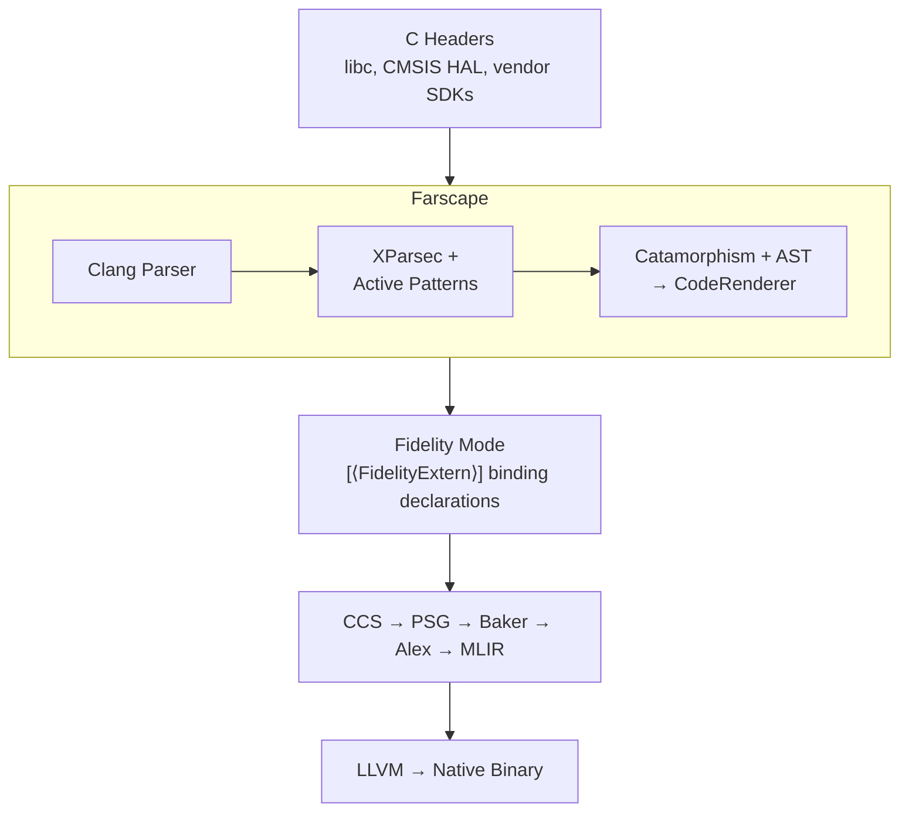

# Farscape Documentation

## Overview

Farscape is the C header binding generator for the Fidelity native Clef compilation ecosystem. It parses C headers using clang and generates type-safe Clef bindings with `[<FidelityExtern>]` attributes, with XParsec parser combinators handling C type decomposition and macro classification.

There is no P/Invoke in the Fidelity framework. Farscape generates `[<FidelityExtern>]` binding declarations for the native pipeline (CCS, Baker, Alex, MLIR, LLVM).

## Table of Contents

### Architecture

1. [Architecture Overview](./01_Architecture_Overview.md): Pipeline structure, four architectural patterns, module roles
2. [BAREWire Integration](./02_BAREWire_Integration.md): Hardware memory/type layout capture from headers
3. [CCS Integration](./03_fsnative_Integration.md): How Farscape output feeds the CCS compilation pipeline
4. [XParsec Architecture](./04_XParsec_Architecture.md): Parser combinators, active patterns, catamorphisms, typed code AST
5. [Wrapper Generation](./05_Wrapper_Generation.md): Layer 2 idiomatic Clef wrapper generation

## Position in the Fidelity Closed-Loop Pipeline

Farscape is one component of a closed-loop native compilation system. `[<FidelityExtern>]` carries library name + symbol through the PSG so Alex can emit MLIR with binding metadata, and the linker auto-collects library flags.

## Two-Layer Binding Model

**Layer 1: Platform.Bindings** - `[<FidelityExtern>]` attributed binding declarations with `Unchecked.defaultof<T>` bodies. Core infrastructure.

**Layer 2: Idiomatic Clef Wrappers** (implemented) - Safe functional APIs with Result types, null checking, error handling. Driven by 12 clang attribute types and 7 return semantic patterns.

## Core Infrastructure Under Development

These are not optional features. They are what makes Farscape part of Fidelity:

1. **`[<FidelityExtern>]` attributes**: Library name + symbol metadata that closes the pipeline loop
2. **BAREWire memory/type layout capture**: Precise struct layout, access constraints, memory regions from header AST
3. **CMSIS qualifier mapping**: `__I` → ReadOnly, `__O` → WriteOnly, `__IO` → ReadWrite

## Dependencies

### CCS (Clef Compiler Services)

CCS is the native type checker that processes Farscape's Clef source. It operates in the Native Type Universe (NTU), a BCL-free, freestanding type system with NTUKind types, SRTP resolution, and union-find constraint solving.

### BAREWire (Memory Descriptor Types)

BAREWire provides hardware descriptor types (`PeripheralDescriptor`, `FieldDescriptor`, `AccessKind`) that Farscape populates from C headers. BAREWire development advances in parallel.

## Output Modes

| Mode | CLI Flag | Target |
|------|----------|--------|
| `fidelity` | `--output-mode fidelity` | Clef Native / Fidelity pipeline (FidelityExtern) |
| `fidelity-wrappers` | `--output-mode fidelity-wrappers` | Clef Native with Layer 2 wrappers |

## What's Implemented

- Clang two-pass C header parsing (JSON AST + macro extraction)
- XParsec post-processing for C type strings and macro values
- Active pattern decomposition (type classification, macro filtering)
- Catamorphism-based declaration traversal
- Typed code AST (FsDecl/FsType) with single CodeRenderer
- Fidelity binding generation (`Unchecked.defaultof` pattern)
- Layer 2 wrapper generation (WrapperPatternAnalyzer + WrapperCodeGenerator)
- Typedef chain resolution, macro constant extraction
- Pilot namespace analysis and TOML project files
- Errno module generation (CError struct, describe jump table, captureError helper)
- 194 unit tests covering all architectural patterns

## Roadmap

- `[<FidelityExtern>]` attribute generation
- BAREWire peripheral descriptor generation from header AST
- CMSIS qualifier extraction (`__I`, `__O`, `__IO` → `AccessKind`)
- Static binding support (LLVM LTO cross-language inlining)
- C++ support via Plugify ABI intelligence
- Migration path toward Atelier Transcribe/Transpose feature

## Related Documentation

| Document | Location |
|----------|----------|
| BAREWire Hardware Descriptors | `~/repos/BAREWire/docs/08 Hardware Descriptors.md` |
| CCS Architecture | `~/repos/fsnative/` (Serena project: CCS) |
| Composer Memory Interlock | `~/repos/Firefly/docs/Memory_Interlock_Requirements.md` |
