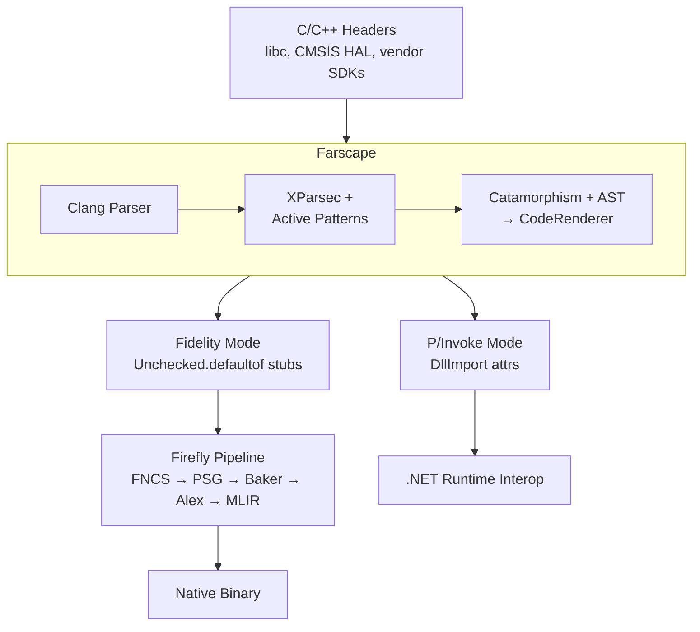

# Farscape Documentation

## Overview

Farscape is the C/C++ binding generator for the Fidelity native F# compilation ecosystem. It parses C/C++ headers using clang and generates type-safe F# bindings, with XParsec parser combinators handling C type decomposition and macro classification.

## Table of Contents

### Architecture

1. [Architecture Overview](./01_Architecture_Overview.md) — Pipeline structure, four architectural patterns, module roles
2. [BAREWire Integration](./02_BAREWire_Integration.md) — Hardware descriptor generation design (PLANNED)
3. [FNCS Integration](./03_fsnative_Integration.md) — How Farscape output feeds the FNCS compilation pipeline
4. [XParsec Architecture](./04_XParsec_Architecture.md) — Parser combinators, active patterns, catamorphisms, typed code AST

## Position in Fidelity Ecosystem



## Dependencies

### FNCS (F# Native Compiler Services)

FNCS is the native type checker that processes the F# source Farscape generates. It operates in the Native Type Universe (NTU) — a BCL-free, freestanding type system with NTUKind types, SRTP resolution, and union-find constraint solving.

Farscape generates `Unchecked.defaultof<T>` stubs. FNCS type-checks them. Baker saturates intrinsic operations. Alex emits platform-specific MLIR.

### BAREWire (Descriptor Types)

BAREWire will provide hardware descriptor types (`PeripheralDescriptor`, `FieldDescriptor`, `AccessKind`) that Farscape populates from CMSIS headers. This is PLANNED — not yet implemented.

## Output Modes

### Fidelity Mode (`--output-mode fidelity`)

Generates `Unchecked.defaultof` stubs for the FNCS → Baker → Alex pipeline:

```fsharp
module Fidelity.libc.Memory

    /// void * memcpy(void *restrict __dest, const void *restrict __src, size_t __n)
    let memcpy (dest: nativeint) (src: nativeint) (n: nativeint) : nativeint =
        Unchecked.defaultof<nativeint>
```

### P/Invoke Mode (`--output-mode pinvoke`)

Traditional .NET P/Invoke bindings with DllImport attributes.

## Development Status

### Implemented

- [x] Clang two-pass C header parsing (JSON AST + macro extraction)
- [x] XParsec post-processing for C type strings and macro values
- [x] Active pattern decomposition (type classification, macro filtering)
- [x] Catamorphism-based declaration traversal
- [x] Typed code AST (FsDecl/FsType) with single CodeRenderer
- [x] Fidelity binding generation (`Unchecked.defaultof` pattern)
- [x] P/Invoke binding generation (DllImport)
- [x] Typedef chain resolution
- [x] Macro constant extraction and numeric literal parsing
- [x] Function pointer type detection (direct and typedef-resolved)
- [x] F# keyword backtick quoting
- [x] Struct/record generation
- [x] Enum generation
- [x] 89 unit tests covering all architectural patterns

### Planned

- [ ] `[<FidelityExtern>]` attribute generation for FNCS recognition
- [ ] BAREWire peripheral descriptor generation
- [ ] Quotation-based output for PSG recognition patterns
- [ ] C++ class/template support
- [ ] CMSIS qualifier extraction (`__I`, `__O`, `__IO` → `AccessKind`)

## Related Documentation

| Document | Location |
|----------|----------|
| BAREWire Hardware Descriptors | `~/repos/BAREWire/docs/08 Hardware Descriptors.md` |
| FNCS Architecture | `~/repos/fsnative/` (Serena project: FNCS) |
| Memory Interlock Requirements | `~/repos/Firefly/docs/Memory_Interlock_Requirements.md` |
